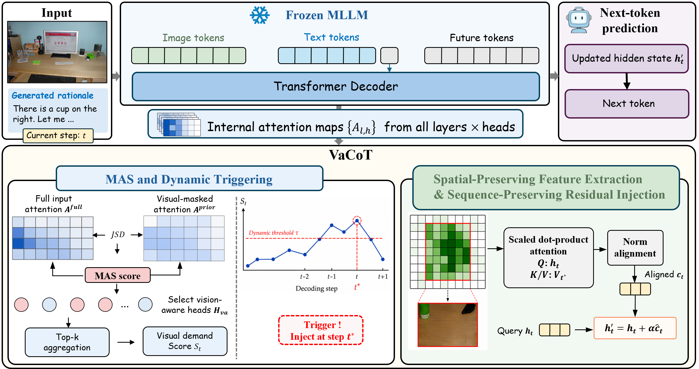

# VaCoT: Visual-Aware Chain-of-Thought Reasoning via Dynamic Evidence Supplementation

This repository contains the implementation of **VaCoT**, a training-free and sequence-preserving framework for dynamic visual evidence supplementation in multimodal Chain-of-Thought reasoning.

VaCoT is designed to mitigate language-prior drift in long-horizon multimodal reasoning. Instead of explicitly appending additional visual tokens during generation, VaCoT estimates the model's internal visual demand, extracts spatially coherent visual evidence, and injects the visual signal into the current textual representation through residual updates.

<p align="center">
  
</p>

## Overview

Multimodal Chain-of-Thought (MCoT) reasoning improves visual question answering by generating intermediate rationales. However, as autoregressive generation proceeds, previously generated textual rationales may accumulate language priors and weaken the model's reliance on image evidence.

VaCoT addresses this issue with three components:

1. **Modality-Aware Shift and Dynamic Triggering**  
   VaCoT identifies vision-aware attention heads by comparing the model's attention distributions under full multimodal input and visually masked input. During decoding, it estimates a step-wise visual demand score and dynamically determines when visual evidence should be revisited.

2. **Spatial-Preserving Feature Extraction**  
   Once visual supplementation is triggered, VaCoT maps attention responses back to the image-token grid and extracts a spatially contiguous visual region, preserving object-level and spatial structure.

3. **Sequence-Preserving Residual Injection**  
   Instead of appending visual tokens to the input sequence, VaCoT injects the extracted visual evidence into the current textual hidden state through a residual update. This keeps the input sequence length unchanged during reasoning.

## Repository Structure

```text
VaCoT/
├── README.md
├── vacot_run.py
├── requirements.txt
├── data/
│   ├── m3cot/
│   └── scienceqa/
├── models/
│   └── vacot_model.py
├── qwen3_vl/
│   ├── vacot_qwen_model.py
│   └── vacot_qwen_utils.py
├── figures/
│   └── gig2_2.png
└── results/
```
## Installation
Install the required packages:
```bash
conda create -n vacot python=3.12
conda activate vacot
pip install -r requirements.txt
```
## Start
```bash
python vacot_run.py
```
